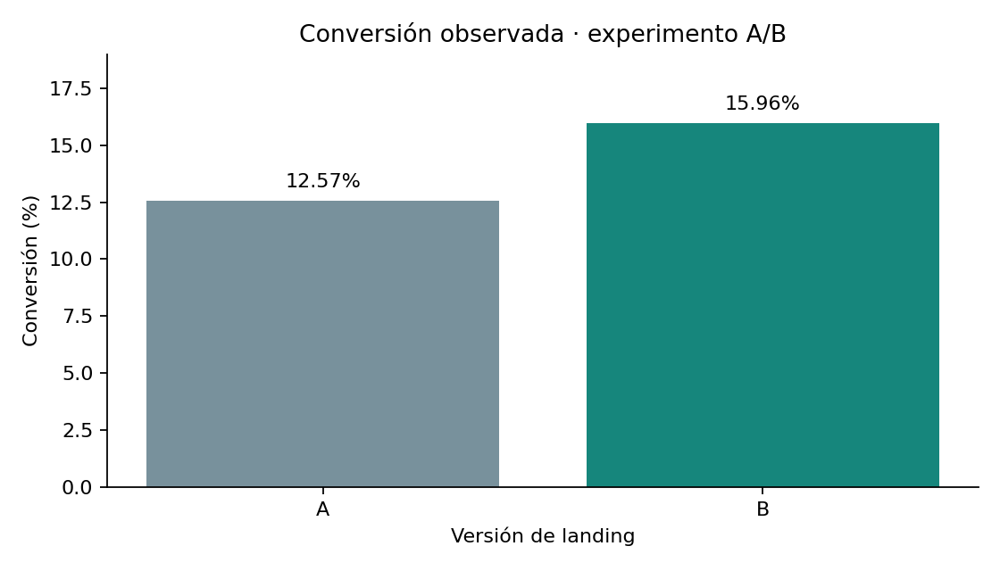

# Experimento A/B de una landing page

**Mario Alberto Vivero Sahagún | Python · pandas · SciPy · Matplotlib**

Comparación de la tasa de conversión entre dos versiones de una página, con 40,000 usuarios del 1 al 28 de enero de 2026, y exploración de diferencias por canal y tipo de usuario.

## Pregunta de negocio

¿La versión B de la página convierte más usuarios que la versión A, y esa diferencia es estadísticamente significativa?

## Hallazgo clave

- **La versión B convierte más:** 15.96% frente a 12.57% de la versión A, una diferencia de **+3.38 puntos porcentuales** (26.92% más en términos relativos).
- **La diferencia es estadísticamente significativa:** intervalo de confianza del 95% de +2.70 a +4.07 puntos y p = 4.3 × 10⁻²².
- **Por canal y tipo de usuario no hay evidencia suficiente** para reasignar presupuesto: la diferencia por canal deja de ser significativa tras un ajuste por comparaciones múltiples (p = 0.0683).

**Qué recomiendo:** evaluar un despliegue gradual de la versión B, después de validar la asignación del experimento y de medir el efecto en gasto, costos y margen.

## Resultados de conversión

| Indicador | Página A | Página B |
|---|---:|---:|
| Usuarios | 19,982 | 20,018 |
| Conversiones | 2,512 | 3,194 |
| Tasa de conversión | 12.57% | 15.96% |

- **Diferencia B−A:** +3.38 puntos porcentuales; incremento relativo de **26.92%**.
- **IC 95% aproximado de la diferencia:** de +2.70 a +4.07 puntos porcentuales.
- **Chi-cuadrada con corrección de continuidad:** 93.3748; **p = 4.3272 × 10⁻²²**.
- Los **682** son la diferencia de conversiones observadas entre grupos de distinto tamaño. Proyectar la diferencia de tasas a 20,018 usuarios equivale a unas **677 conversiones**, bajo el supuesto de tasas constantes; no es una medición adicional de clientes incrementales.

## Segmentación y gasto

| Comparación | Resultado | Interpretación |
|---|---|---|
| Canal y conversión | Email 14.99%; Ads 14.74%; Referral 13.88%; Organic 13.79%; p global = 0.0341 | Asociación nominal sin ajuste; no identifica pares ganadores ni rentabilidad |
| Tipo de usuario y conversión | Nuevos 14.36%; recurrentes 14.09%; p = 0.4736 | Evidencia insuficiente para rechazar independencia; no demuestra igualdad |
| Gasto entre compradores | t histórico = −9.3656; p impreso como 0.0000 | Resultado original condicionado a haber convertido; no es gasto por usuario asignado |

Un ajuste Holm ilustrativo sobre las dos pruebas exploratorias de segmentación eleva el p de canales a **0.0683**. La familia de pruebas no estaba preespecificada: se muestra como sensibilidad, no como un plan original. La prueba principal de conversión se presenta por separado.

El análisis de gasto original usa Student con varianzas iguales por defecto, solo para quienes convirtieron. No se aportaron los microdatos ni medias y varianzas por grupo para recalcularlo. Un p redondeado a 0.0000 no es cero. La selección de compradores ocurre después de la asignación, por lo que esa comparación no identifica por sí sola un efecto causal sobre gasto.

## Recomendaciones

1. Considerar B para un despliegue gradual, sujeto a comprobar aleatorización, instrumentación, periodo de medición y métricas de protección.
2. Evaluar gasto promedio de **todos los usuarios asignados**, incluidos ceros, junto con costos, devoluciones y margen antes de afirmar mejora económica.
3. Investigar canales con pruebas planificadas, costos de adquisición y valor de cliente; no aumentar presupuesto solo por el ranking de conversión.
4. Mantener abierta la evaluación de segmentos. Para saber si B funciona distinto por canal o tipo se necesitan cruces con la versión o pruebas de interacción, ausentes en los conteos disponibles.

## Qué puede reproducirse
   El [notebook principal](notebooks/analisis_conversion.ipynb) recalcula conversión, chi-cuadrada, intervalos de confianza, tasas por segmento y un chequeo de reparto bajo un diseño 50/50. Parte de los conteos observados del experimento (`data/conteos_observados.json`), transcritos de las salidas del notebook original.

El [notebook original documentado](notebooks/analisis_original_documentado.ipynb) conserva el código y sus salidas históricas, sin consignas ni comentarios de revisión. **No fue ejecutado de nuevo**: necesita `landing_experiment.csv`, que no fue adjuntado. El original recibido se conserva sin cambios fuera de esta copia de portafolio.

   El [script complementario](validar_microdatos.py) agrega verificaciones de los datos y una prueba de Welch sobre el gasto de todos los usuarios. No se ha ejecutado porque requiere el CSV original, que no se incluye en el repositorio.
   
## Uso

1. Instala las dependencias: `python -m pip install -r requirements.txt`.
2. Ejecuta `jupyter notebook` y abre `notebooks/analisis_conversion.ipynb`.
3. Ejecuta todas las celdas. El archivo `data/conteos_observados.json` ya está incluido.

Para ejecutar los análisis individuales, coloca la fuente en `data/landing_experiment.csv`. Ejecuta el script desde la raíz con `python validar_microdatos.py`. Las versiones de pandas, SciPy y Matplotlib corresponden al entorno usado para el notebook principal; no se probó una instalación nueva desde pip.

## Validación y límites

   Proyecto académico presentado como caso de análisis; no corresponde a un experimento realizado para una empresa real.
   
Los conteos de cada tabla suman 40,000 usuarios y 5,706 conversiones, y reproducen las tres chi-cuadradas guardadas. El original reporta 40,000 identificadores únicos y ninguna celda nula, pero no se comprobó de nuevo sin la fuente. No hay evidencia de una verificación completa de supuestos de la prueba de gasto.

El chequeo de tamaños arroja p ≈0.857 **si** el diseño esperado era 50/50; no demuestra aleatorización ni balance de características. La interpretación inferencial presupone independencia y un experimento correctamente implementado. No se documentaron asignación, potencia, horizonte predefinido ni monitoreo secuencial. Las pruebas segmentadas reúnen A y B y no evalúan efectos heterogéneos.

No se inventaron usuarios, gastos ni un CSV sintético. La procedencia y licencia del dataset académico no se verificaron y no se asigna licencia abierta a los datos. Ver [resumen ejecutivo](docs/resumen_ejecutivo.md).
